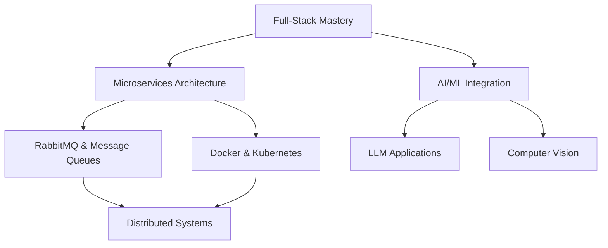

# Hi there, I'm Pratik Chavan! 👋

<div align="center">
  
[](https://git.io/typing-svg)

</div>

<p align="center">
  
  
  
  
  
</p>

---

## 🚀 About Me

I'm a passionate **Computer Engineering undergraduate** at **Pune Institute of Computer Technology (PICT)**, driven by the art of transforming ideas into impactful digital solutions.

```javascript
const pratik = {
    pronouns: "He" | "Him",
    location: "Nagpur, Maharashtra, India",
    education: "Computer Engineering @ PICT",
    currentFocus: ["Full-Stack Development", "AI/ML Applications", "System Design"],
    askMeAbout: ["Web Dev", "AI/ML", "System Architecture", "Problem Solving"],
    technologies: {
        frontEnd: ["React.js", "Next.js", "Tailwind CSS", "Material UI"],
        backEnd: ["Node.js", "Express.js", "Flask", "FastAPI"],
        databases: ["MongoDB", "PostgreSQL", "Prisma ORM"],
        ai_ml: ["LangChain", "HuggingFace", "FAISS", "Scikit-learn"],
        languages: ["JavaScript", "Python", "C++", "Java", "SQL"]
    },
    currentlyLearning: ["Microservices", "RabbitMQ", "Distributed Systems"],
    motto: "Code. Learn. Build. Repeat."
};
```

## 🎯 What I'm Up To

- 🔭 **Currently Working On:** Building scalable AI-powered applications
- 🌱 **Learning:** Advanced system design patterns and cloud architectures
- 👯 **Looking to Collaborate:** Open source projects and innovative hackathon ideas
- 🤔 **Exploring:** The intersection of AI/ML with web technologies
- 💬 **Ask Me About:** Full-stack development, DSA, or anything tech!
- ⚡ **Fun Fact:** I debug with console.log() and I'm not ashamed! 😄

## 🏆 Achievements & Highlights

<div align="center">

| 🎖️ Achievement | 🏅 Recognition | 📅 Year |
|----------------|----------------|---------|
| **1st Runner-Up + Best UI Award** | COEP Inspiron Hackathon | 2024 |
| **TechFiesta Finalist** | Among 400+ National Teams | 2024 |
| **Strong DSA Foundation** | Consistent Problem Solving | Ongoing |

</div>

## 🛠️ Technology Arsenal

<div align="center">

### 💻 Programming Languages


### 🎨 Frontend Development


### 🔧 Backend Development


### 🗄️ Databases


### 🤖 AI/ML & Tools


### 🔨 Development Tools


</div>

## 📊 GitHub Analytics

<div align="center">
  
  
</div>

<div align="center">
  
</div>

<div align="center">
  
</div>

## 🎯 Current Learning Path



## 🤝 Let's Connect & Collaborate

<div align="center">

[](https://linkedin.com/in/pratik-chavan-09bb0b2a1)
[](mailto:pratikpchavan75@gmail.com)
[](https://pratikchavan05-portfolio.vercel.app)
[](https://github.com/PratikChavan05)

</div>

## 💭 Random Dev Quote

<div align="center">


</div>

---

<div align="center">
  
### 🎵 *"First, solve the problem. Then, write the code."* - John Johnson

**Thanks for visiting my profile! Let's build something amazing together! 🚀**


</div>
